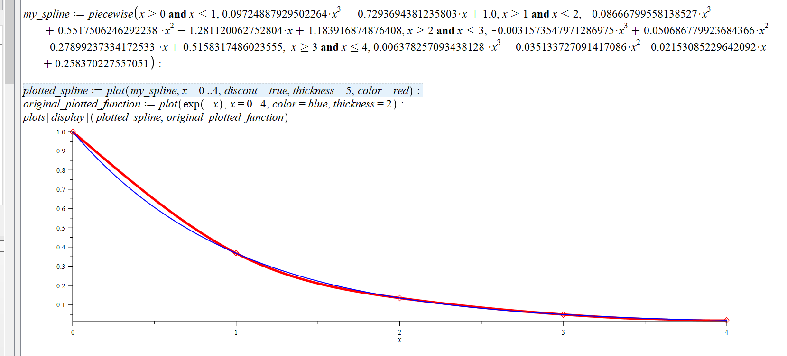
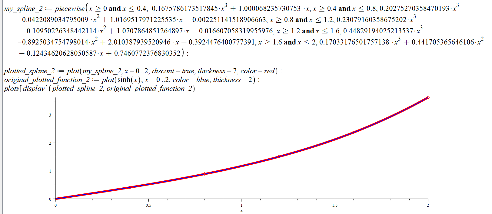
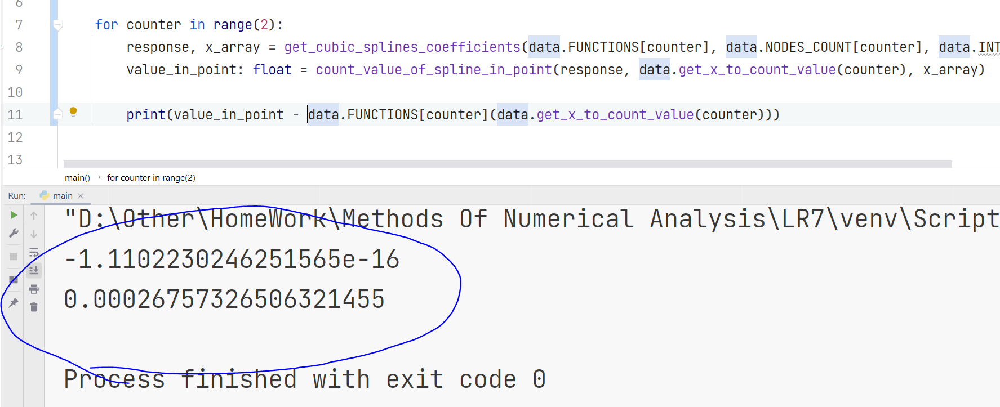

### Лабораторная работа №7:  Интерполяция сплайнами
&nbsp;

* Построение кубического сплайна (с дефектом 1)  
&nbsp;   

### 2 примера (варианты 1, 5), отображающие результаты построения сплайнов  
_(уже после совмещения кубических полиномов (с коэффициентами, которые выдала программа) и графика оригинальной функции)_  

  
&nbsp;   

### Для вариантов 1, 5 значение функции и значение сплайна в заданной точке отличаются на:  

&nbsp;  

###### Copyright ©  May, 2022